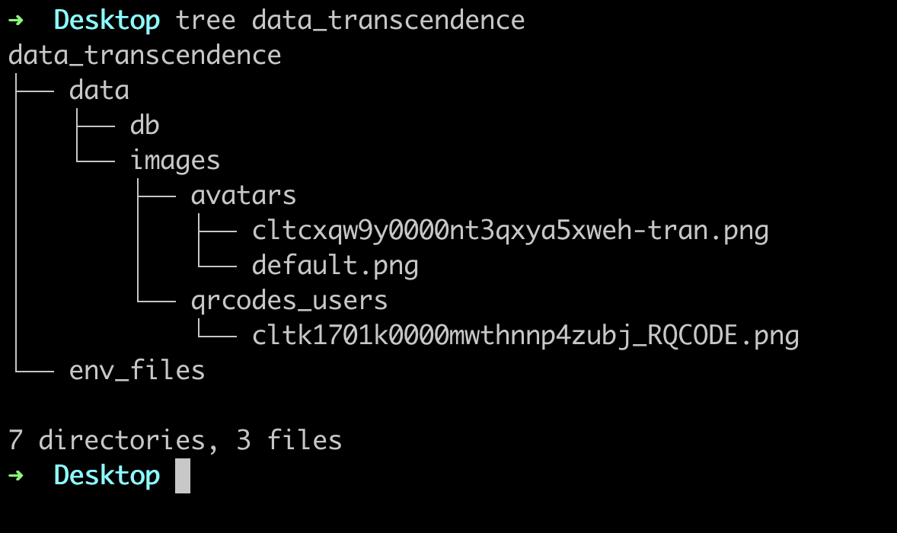

# Hi there 
transcendence is a project in the 42 intra #Enjoy


# show case of the project will be

To run transcendence project you should first have the environments variable and the volume for the the database container

the path should be on your Desktop three folder is



# in the env_files folder there is three hidden files each file contains environment variables

# .env_back_end has this environment variable

```
DATABASE_URL=""

SECRET_JWT_TOKEN=""

ENCRYPT_SECRET=""

ALGORITHM_ENCRYPT="aes-256-ctr"

SALT_ENCRYPT=""

PATH_AVATAR_USERS="/avatar_users_images/"

INTRA_GRANT_TYPE="authorization_code"

INTRA_CLIENT_ID="provided by the Intra 42"

IP="IP address of your machine"

INTRA_CLIENT_SECRET="provided by the Intra 42"

INTRA_REDIRECT_URI="/auth/42/callback/"

PATH_QR_CODES="/qrcodes_users/"

PORT_BACK_END="3333"

```

# .env_front_end has this environment variable

```
REACT_APP_PUBLIC_IP="IP address of your machine"

REACT_APP_BACK_END_PORT="3333"

REACT_APP_PUBLIC_URL="front-end/public/"

```

# .env_db has this environment variable

```
POSTGRES_USER="postgres"

POSTGRES_PASSWORD="123"

POSTGRES_DB="nest"

```

# if all is good i mean this set up you should run 

```
make
```

make will run the docker compose 

# to clean the project run 

```
make clean
```

# to remove the images run 

```
make fclean
```

